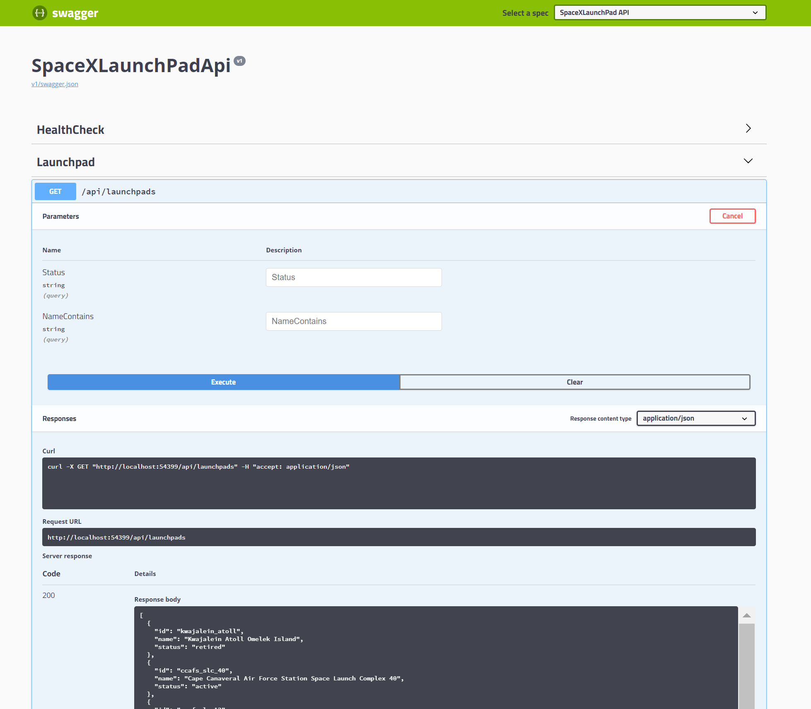
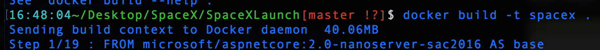

# SpaceX

This repo exposes the launchpad api from Open Space-X Api found [here](https://github.com/r-spacex/SpaceX-API/blob/master/docs/launchpad.md)

Why contact the SpaceX-Api directly, when you can work through a middle man?

## Features
- Exposes Launchpad information regarding Id, Name, and Status.
- Filter launchpads by status, partial or whole name, or both.
- You can find documentation of this api by its Swagger page. It is found on 

## Local Setup
- Download this repo
- You can use Visual Studio to open the sln file, and press IISExpress. 
- For Docker, go to the DockerFile location in terminal and it docker build and then docker run using the container id. You can find the container id with "docker ps". This is experimental, so please check your local settings.

## Next Steps
- Adding to Docker Hub by tagging and uploading the image.
- Filtering that includes EitherOr functionality between properties.

